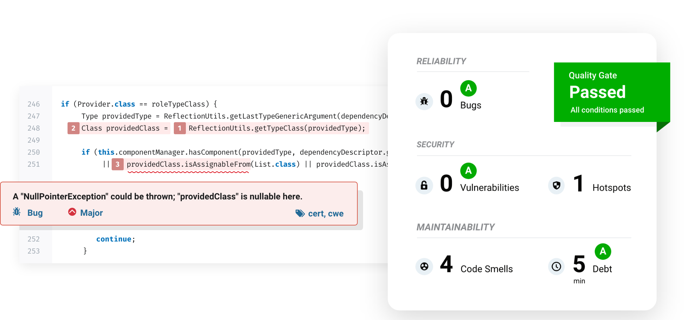

<p align="center">
  <a href="https://supportukrainenow.org" target="_blank">
    
  </a>
</p>
<br/>
<p align="center">
  <a href="http://github.com/luisaveiro/localhost-sonarqube">
    
  </a>
</p>

<h4 align="center">
    Analysing source code locally with SonarQube in a Docker environment.
</h4>

<p align="center">
  <a href="#tldr">TL;DR</a> •
  <a href="#about">About</a> •
  <a href="#disclaimer">Disclaimer</a> •
  <a href="#getting-started">Getting Started</a> •
  <a href="#download">Download</a> •
  <a href="#how-to-use">How To Use</a> •
  <a href="#commands">Commands</a> •
  <a href="#faq">FAQ</a>
</p>
<p align="center">
  <a href="#useful-tips">Useful Tips</a> •
  <a href="#changelog">Changelog</a> •
  <a href="#contributing">Contributing</a> •
  <a href="#security-vulnerabilities">Security Vulnerabilities</a> •
  <a href="#credits">Credits</a> •
  <a href="#Sponsor">Sponsor</a> •
  <a href="#license">License</a>
</p>

## <a id="tldr"></a> TL;DR

***Localhost SonarQube*** offers a light-weight command-line interface for interacting with [SonarQube](https://www.sonarqube.org/) 
*Community Edition* and analyse your source code with SonarScanner (*CLI*) in a Docker environment.

#### Quick Start

1. Clone this repository.
2. Configure a Bash alias in `~/.bashrc` or `~/.zshrc` that allows you to 
execute the ***Localhost SonarQube*** Shell script more easily.
3. Start SonarQube dashboard.

##### Quick Setup:

```bash
# Clone this repository.
$ git clone git@github.com:luisaveiro/localhost-sonarqube.git

# Create Alias
alias sonarqube='bash ~/localhost-sonarqube/sonarqube'

# Start SonarQube Docker containers.
$ sonarqube up
```

## About

***Localhost SonarQube*** offers a light-weight command-line interface for interacting with [SonarQube](https://www.sonarqube.org/) 
*Community Edition* and analyse your source code with SonarScanner (*CLI*) in a Docker environment.

The **sonarqube** Shell script provides convenient CLI commands for interacting with the Docker containers defined by 
the **compose.yaml** file. It also provides a method to copy SonarScanner configuration templates 
(*sonar-project.properties*) for easy setup.

[SonarQube](https://www.sonarqube.org/) is an open-source platform developed by SonarSource for continuous inspection 
of code quality to perform automatic reviews with static analysis of code to detect bugs, code smells, and security 
vulnerabilities on 20+ programming languages.

<p align="center">
  <a href="https://www.sonarqube.org">
    
  </a>
  <sub><sup>[Source: www.sonarqube.org]</sup></sub>
</p>

## Disclaimer

> **Note**
> : ***Localhost SonarQube*** is not affiliated with SonarSource SA and is not an official product. 
**"SONARQUBE"** is a trademark belonging to SonarSource SA.

***Localhost SonarQube*** has been developed to run SonarQube in a local Docker environment. To install a production 
instance, read the SonarQube [Requirements](https://docs.sonarqube.org/latest/requirements/requirements/), and 
then follow the [Installation Guide](https://docs.sonarqube.org/latest/setup/install-server/).

**Please note:** This readme assumes you are familiar with SonarQube and will not be covering on how to set up projects 
in SonarQube and configure **sonar-project.properties** files to analyse a project. Please visit 
[Localhost SonarQube Wiki](https://github.com/luisaveiro/localhost-sonarqube/wiki) or alternatively visit
[SonarQube Documentation](https://docs.sonarqube.org/latest/setup/get-started-2-minutes/) for additional instructions 
or [SonarSource Community forum](https://community.sonarsource.com/) for assistance.


## Getting Started

You will need to make sure your system meets the following prerequisites:

- Docker Engine >= 20.10.00

This repository utilizes [Docker](https://www.docker.com/) to run SonarQube and SonarScanner. So, before using the CLI 
commands, make sure you have Docker installed on your system.

## Download

You can clone the latest version of ***Localhost SonarQube repository*** for macOS, Linux and Windows (via WSL2).

```bash
# Clone this repository.
$ git clone git@github.com:luisaveiro/localhost-sonarqube.git --branch main --single-branch
```

## How To Use

By default, ***Localhost SonarQube*** commands are invoked using the `path/localhost-sonarqube/sonarqube` script, for example:

```bash
# Start SonarQube Docker containers.
$ bash ~/localhost-sonarqube/sonarqube up
```

#### <ins>Configuring A Bash Alias</ins>

Instead of you repeatedly typing `bash path/localhost-sonarqube/sonarqube` to execute ***Localhost SonarQube*** 
Shell script, you can configure a Bash alias in `~/.bashrc` or `~/.zshrc` that allows you to execute the commands more 
easily:

```bash
alias sonarqube='bash ~/localhost-sonarqube/sonarqube'
```

Once the Bash alias has been configured, you may execute ***Localhost SonarQube*** commands by simply typing 
**sonarqube**. The remainder of this readme's examples will assume that you have configured this alias:

```bash
# Start SonarQube Docker containers.
$ sonarqube up
```

## Commands

The **sonarqube** Shell script provides convenient CLI commands for interacting with the Docker containers defined by the 
**compose.yaml** file and running SonarScanner Docker image to analyse your project source code. The following 
commands are available for you to interact with your SonarQube Docker environment.

| #  	| Commands              	| Description                                                    	|
|----	|-----------------------	|----------------------------------------------------------------	|
| 1  	| sonarqube             	| Display a list of all available commands.                      	|
| 2  	| sonarqube about       	| Shows a short information about Localhost SonarQube.           	|
| 3  	| sonarqube config      	| Display Localhost SonarQube Docker Compose config.             	|
| 4  	| sonarqube dashboard   	| Open SonarQube dashboard in the browser.                       	|
| 5  	| sonarqube docs        	| Open Localhost SonarQube documentation in the browser.         	|
| 6  	| sonarqube down        	| Stop SonarQube Docker containers.                              	|
| 7  	| sonarqube fund        	| Display Localhost SonarQube funding information.               	|
| 8  	| sonarqube help        	| Display helpful information for a command.                     	|
| 9  	| sonarqube list        	| List available SonarScanner properties files.                  	|
| 10 	| sonarqube port        	| Set the SonarQube dashboard port.                              	|
| 11 	| sonarqube publish     	| Publish SonarScanner properties file to a project directory.   	|
| 12 	| sonarqube restart     	| Restart SonarQube Docker containers.                           	|
| 13 	| sonarqube scan        	| Scan project source code with SonarScanner.                    	|
| 14 	| sonarqube self-update 	| Update Localhost SonarQube to the latest version.              	|
| 15 	| sonarqube status      	| Get the current status of SonarQube & SonarScanner containers. 	|
| 16 	| sonarqube up          	| Start SonarQube Docker containers.                             	|
| 17 	| sonarqube version     	| Display Localhost SonarQube installed version.                 	|

Below I have provided more information on each `sonarqube` CLI command.

---

<details>
<summary><a id="usage-command"></a> 1. <b>Sonarqube usage/alias</b></summary>

You can use the **sonarqube** Bash alias without providing commands to view a list of all available commands. 
Alternatively, you can use the **usage** command or use either the **--help** or **-h** option.

```bash
# Display a list of all available commands.
$ sonarqube

# Or use usage command.
$ sonarqube usage

# Or use --help option.
$ sonarqube --help

# Or use -h option.
$ sonarqube -h
```

#### Preview

<p align="center">
  <a href="http://github.com/luisaveiro/localhost-sonarqube#usage-command">
    
  </a>
</p>

</details>

---

<details>
<summary><a id="about-command"></a> 2 <b>About command</b></summary>

The **about** command displays information including the ***Localhost SonarQube*** installed version (Git checked out 
tag or branch) and the path for `/localhost-sonarqube/sonarqube`.

```bash
# Shows a short information about Localhost SonarQube.
$ sonarqube about
```

</details>

---

<details>
<summary><a id="config-command"></a> 3. <b>Config command</b></summary>

The **config** command is a pass through command for `docker-compose config` command. Docker Compose will validate and 
display ***Localhost SonarQube*** Docker Compose file configuration.

```bash
# Display Localhost SonarQube Docker Compose config.
$ sonarqube config
```

</details>

---

<details>
<summary><a id="dashboard-command"></a> 4. <b>Dashboard command</b></summary>

Once the SonarQube containers are up and running, you may access SonarQube dashboard in your web browser at: 
http://localhost:9000 or use the **dashboard** command to open SonarQube dashboard in your default browser.

```bash
# Open SonarQube dashboard in the browser.
$ sonarqube dashboard
```

The first time you log in to the SonarQube dashboard, you will use the default System Administrator credentials:

- login: **admin**
- password: **admin**

SonarQube will request you to **change your password** once you are logged in with the default System Administrator 
credentials.

</details>

---

<details>
<summary><a id="docs-command"></a> 5. <b>Docs command</b></summary>

To easily open ***Localhost SonarQube*** readme documentation in your web browser, you can use the **docs** command.

```bash
# Open Localhost SonarQube documentation in the browser.
$ sonarqube docs
```

If you want to view ***Localhost SonarQube** Wikis documentation you can use the **--wiki** option for the **docs** 
command. Alternatively, you can use the **wiki** alias command.


```bash
# Open Localhost SonarQube Wikis documentation in the browser.
$ sonarqube docs --wiki

# Or use alias command
$ sonarqube wiki
```

</details>

---

<details>
<summary><a id="down-command"></a> 6. <b>Down command</b></summary>

To stop all of the Docker containers defined in ***Localhost SonarQube*** **compose.yaml** file, you may execute 
the **down** command. Alternatively, you can use the **stop** alias command.

```bash
# Stop SonarQube Docker containers.
$ sonarqube down

# Or use alias command
$ sonarqube stop
```

> **Note**
> : The **down** command will not stop the SonnarScanner container scanning your projects.

</details>

---

<details>
<summary><a id="fund-command"></a> 7. <b>Fund command</b></summary>

If you want to support **Localhost SonarQube** development, the **fund** command will display the funding information. 
Alternatively, you can use the **support** alias command.

```bash
# Display Localhost SonarQube funding information.
$ sonarqube fund

# Or use alias command
$ sonarqube support
```

</details>

---

<details>
<summary><a id="help-command"></a> 8. <b>Help command</b></summary>

***Localhost SonarQube*** provides a **help** command to easily view helpful information for a command including usage, 
available arguments and options.

```bash
# The help command displays help for a given command.
$ sonarqube help publish
```

</details>

---

<details>
<summary><a id="list-command"></a> 9. <b>List command</b></summary>

All SonarScanner configuration templates (*sonar-project.properties*) are located in the `sonarscanner-templates` 
directory. You can use the **list** command to easily view available SonarScanner configuration templates as a list in 
your terminal.

```bash
# List available SonarScanner properties files.
$ sonarqube list
```

If you want to contribute a SonarScanner configuration template, please see the [contributing section](#contributing).

</details>

---

<details>
<summary><a id="port-command"></a> 10. <b>Port command</b></summary>

***Localhost SonarQube*** run on port 9000 by default. However, if you 
experience the Docker container port binding failure message - Bind for 
0.0.0.0:9000 failed: port is already allocated. You can configure 
***Localhost SonarQube*** port by using the port command.

```bash
# Change the port.
$ sonarqube port 8080
```

> **Note**
> : The readme will assume that you have configured ***Localhost SonarQube*** port to be 9000 (default).

</details>


---

<details>
<summary><a id="published-command"></a> 11. <b>Publish command</b></summary>

Once the SonarQube Docker containers are up and running, you're ready to use SonarScanner and begin creating projects. 
To do that, you must configure SonarScanner `sonar-project.properties` that is most appropriate for your needs.

***Localhost SonarQube*** repository includes a default `sonar-project.properties`. You can use the **publish** command 
to copy the default `sonar-project.properties` to your project root directory.

```bash
$ sonarqube publish
```

The **publish** command also accepts a template name as an argument and copy the template `sonar-project.properties` to 
your project root directory. 

```bash
$ sonarqube publish default
```

Please visit [SonarScanner Analysis Parameters Documentation](https://docs.sonarqube.org/latest/analysis/analysis-parameters/) 
for additional instructions to configure project analysis settings.

</details>

---

<details>
<summary><a id="restart-command"></a> 12. <b>Restart command</b></summary>

To restart all of the Docker containers defined in ***Localhost SonarQube*** `compose.yaml` file, you may execute 
the **restart** command.

```bash
# Restart SonarQube Docker containers.
$ sonarqube restart
```

> **Note**
> : The **restart** command will not restart the SonnarScanner Docker container.

</details>

---

<details>
<summary><a id="scan-command"></a> 13. <b>Scan command</b></summary>

Once you have configured SonarScanner `sonar-project.properties` file for your project. You can run the **scan** 
command in your project root directory to analyse your project source code. Alternatively, you can use the **analyse** 
alias command.

```bash
# Scan project source code with SonarScanner.
$ sonarqube scan

# Or use alias command
$ sonarqube analyse
```

</details>

---

<details>
<summary><a id="self-update-command"></a> 14. <b>Self-update command</b></summary>

To ensure you have the latest version of ***Localhost SonarQube***, you can use the **self-update** command:

```bash
# Update Localhost SonarQube to the latest version.
$ sonarqube self-update
```

The **self-update** command will also update SonarQube and SonarScanner Docker images to the latest version.

> **Note**
> : when accessing SonarQube Dashboard and presented with SonarQube is under maintenance. You will need to go to 
[http://localhost:9000/setup](http://localhost:9000/setup) and follow the instructions. SonarQube will reanalyze your 
projects.

</details>

---

<details>
<summary><a id="status-command"></a> 15. <b>Status command</b></summary>

***Localhost SonarQube*** provides a **status** command to easily view the current status of SonarQube & SonarScanner 
containers.

```bash
# Get the current status of SonarQube & SonarScanner containers.
$ sonarqube status
```

</details>

---

<details>
<summary><a id="up-command"></a> 16. <b>Up command</b></summary>

To start all of the Docker containers defined in ***Localhost SonarQube*** `compose.yaml` file, you can execute 
the **up** command. Alternatively, you can use the **start** alias command.

```bash
# Start SonarQube Docker containers.
$ sonarqube up

# Or use alias command
$ sonarqube start
```

The Docker containers will run in the background ("detached" mode). Once the SonarQube Docker containers have been 
started, you may access the SonarQube dashboard in your web browser at: http://localhost:9000.

> **Note**
> : The **up** command will not start the SonnarScanner Docker container.

</details>

---

<details>
<summary><a id="version-command"></a> 17. <b>Version command</b></summary>

The *version* command displays ***Localhost SonarQube*** installed version (Git checked out tag or branch). 
Alternatively, you can use either the **--version** or **-v** option.

```bash
# Display Localhost SonarQube installed version.
$ sonarqube version

# Or use --version option.
$ sonarqube --version

# Or use -v option.
$ sonarqube -v
```

</details>

---

## FAQ

**Q:** When accessing the SonarQube Dashboard, I'm presented with the message "SonarQube is under maintenance."  
**A:** You will need to go to [http://localhost:9000/setup](http://localhost:9000/setup) and follow the instructions. 
SonarQube will reanalyze your projects.

**Q:** I need to create a new authentication token.  
**A:** In SonarQube Dashboard, you can generate new tokens at **User > My Account > Security**.

## Useful Tips

[SonarCloud](https://sonarcloud.io/) enhance your workflow with continuous code quality, SonarCloud automatically 
analyzes and decorates pull requests on GitHub, Bitbucket, Azure DevOps and GitLab on most programming languages. 
SonarCloud is free for open-source projects.

SonarSource offers a free IDE extension called [SonarLint](https://www.sonarlint.org/) which helps you to detect and 
fix code quality issues while you write your code. SonarLint is a support plugin for the following IDEs.

- [Eclipse](https://www.sonarlint.org/eclipse/)
- [IntelliJ IDEA](https://www.sonarlint.org/intellij/)
- [Visual Studio](https://www.sonarlint.org/visualstudio/)
- [VS Code](https://www.sonarlint.org/vscode/)

## Changelog

Please see [CHANGELOG](CHANGELOG.md) for more information what has changed recently.

## Contributing

I encourage you to contribute to ***Localhost SonarQube***! Contributions are what make the open source community such 
an amazing place to be learn, inspire, and create. Any contributions you make are **greatly appreciated**.

Please check out the [contributing to Localhost SonarQube guide](.github/CONTRIBUTING.md) for guidelines about how to 
proceed.

## Security Vulnerabilities

Trying to report a possible security vulnerability in ***Localhost SonarQube***? Please check out our 
[security policy](.github/SECURITY.md) for guidelines about how to proceed.

## Credits

The illustration used in the project is from [unDraw (created by Katerina Limpitsouni)](https://undraw.co/). All product 
names, logos, brands, trademarks and registered trademarks are property of their respective owners.

This software uses the following open source packages:

- [ANSI Code Generator](https://github.com/fidian/ansi)

## Sponsor

Do you like this project? Support it by donating.

<a href="https://www.buymeacoffee.com/luisaveiro">
  
</a>

## License

The MIT License (MIT). Please see [License File](LICENSE) for more information.

---

<p align="center">
  <a href="http://github.com/luisaveiro" target="_blank">GitHub</a> •
  <a href="https://uk.linkedin.com/in/luisaveiro" target="_blank">LinkedIn</a> •
  <a href="https://twitter.com/luisdeaveiro" target="_blank">Twitter</a>
</p>
